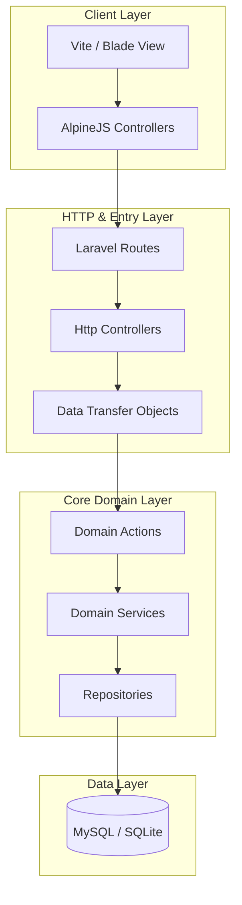

# 🏫 Dershane ERP

    

## 📖 Overview
Dershane ERP is a production-ready educational management and SaaS platform. It allows educational institutions to manage student records, CRM leads, classrooms, attendance sheets, and curriculum schedules. 

Designed with a **Single Codebase, Multi-Edition** approach, the platform leverages dynamic Feature Flags to distribute features across three licensing tiers (Basic, Professional, and Ultimate) without code branching.

---

## 🚀 Key Features
*   **Multi-Edition SaaS Flow:** Dynamically turns on/off CRM, scheduling, or ERP metrics depending on the active license flag.
*   **Domain-Driven Structure:** Separates operations into Domain boundaries, using clean DTOs and Actions instead of cluttered controller layers.
*   **Robust RBAC Permissions:** Built-in custom Role-Based Access Control (RBAC) supporting granular authorization rules and route guards.
*   **Strict Type Assertions:** Strict types declared across all domain boundaries and validated via PHPStan static analysis.

---

## 🏗️ Architecture & Flow



---

## 📁 Folder Structure

```directory
app/
├── Core/             # Base configurations & kernel components
├── Domain/           # Domain boundaries & entities
│   ├── Auth/         # Custom authentication flows
│   ├── CRM/          # Leads and client tracking
│   ├── ERP/          # Classrooms, attendance, schedules
│   └── RBAC/         # User roles and permissions
├── DTOs/             # Unified Data Transfer Objects
├── Actions/          # Atomic business rules
├── Repositories/     # Database queries abstraction
├── ViewModels/       # View state adapters
└── Http/             # Slim entry controllers & API routes
```

---

## 🛠️ Tech Stack & Dependencies
*   **Core:** PHP 8.4, Laravel 12
*   **Frontend:** Blade templates, AlpineJS, TailwindCSS, Vite
*   **Database:** SQLite (development), MySQL / PostgreSQL (production)
*   **Standards:** PSR-12, PHPStan (Static Analysis), Laravel Pint (Linter)

---

## ⚙️ Installation & Configuration

1. Clone the repository and install packages:
   ```bash
   composer install
   npm install && npm run build
   ```
2. Copy the environment configuration and generate the key:
   ```bash
   cp .env.example .env
   php artisan key:generate
   ```
3. Initialize the database and run seeds:
   ```bash
   php artisan migrate --seed
   ```
4. Start the server:
   ```bash
   php artisan serve
   ```

---

## 🧪 Testing
Run PHPUnit tests and static analysis:
```bash
./vendor/bin/phpstan analyse
composer test
```

---

## 📄 License & Contributing
This project is licensed under the MIT License. Contributions are welcome—please submit a Pull Request.
