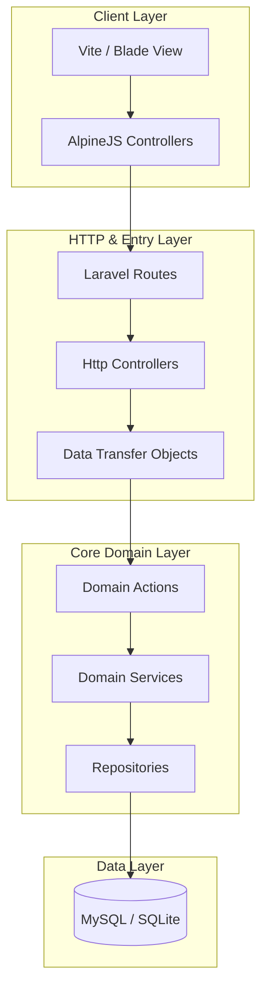

# 🏫 Dershane ERP

    

## 📖 Overview
Dershane ERP is a production-ready educational management and SaaS platform. It allows educational institutions to manage student records, CRM leads, classrooms, attendance sheets, and curriculum schedules. 

Designed with a **Single Codebase, Multi-Edition** approach, the platform leverages dynamic Feature Flags to distribute features across three licensing tiers (Basic, Professional, and Ultimate) without code branching.

---

## 🚀 Key Features
*   **Multi-Edition SaaS Flow:** Dynamically turns on/off CRM, scheduling, or ERP metrics depending on the active license flag.
*   **Domain-Driven Structure:** Separates operations into Domain boundaries, using clean DTOs and Actions instead of cluttered controller layers.
*   **Robust RBAC Permissions:** Built-in custom Role-Based Access Control (RBAC) supporting granular authorization rules and route guards.
*   **Strict Type Assertions:** Strict types declared across all domain boundaries and validated via PHPStan static analysis.

---

## 🏗️ Architecture & Flow


```mermaid
graph TD
    subgraph Client Layer
        V[Vite / Blade View] --> A[AlpineJS Controllers]
    end
    subgraph HTTP & Entry Layer
        A --> R[Laravel Routes]
        R --> C[Http Controllers]
        C --> DTO[Data Transfer Objects]
    end
    subgraph Core Domain Layer
        DTO --> ACT[Domain Actions]
        ACT --> SRV[Domain Services]
        SRV --> REP[Repositories]
    end
    subgraph Data Layer
        REP --> DB[(MySQL / SQLite)]
    end
```

---

## ⚙️ Kurulum (Installation)

1. Clone the repository and install packages:
   ```bash
   composer install
   npm install && npm run build
   ```
2. Copy the environment configuration and generate the key:
   ```bash
   cp .env.example .env
   php artisan key:generate
   ```

## 🗄️ Migration & Seeder

Run the migrations to create the database schema:
```bash
php artisan migrate
```

To populate the database with default roles, permissions, and demo data, run the seeder:
```bash
php artisan db:seed
```
*(Or use `php artisan migrate --seed` to do both at once).*

## 🧪 Test

Run PHPUnit tests to ensure all functionality and critical flows are working correctly:
```bash
php artisan test
```
To run static analysis:
```bash
./vendor/bin/phpstan analyse
```

## 🚀 Production Deployment

For production environments, ensure you cache the configurations and routes:
```bash
php artisan optimize
```
Also, ensure frontend assets are compiled for production:
```bash
npm run build
```

## 🔄 Queue

The application uses Laravel queues for background tasks (e.g., sending notifications, processing reports). Start the queue worker using Supervisor or manually:
```bash
php artisan queue:work
```

## ⚡ Cache

We heavily rely on caching for dashboard metrics and RBAC rules. You can clear the cache using:
```bash
php artisan cache:clear
# or for full optimization clearing:
php artisan optimize:clear
```

## 📁 Storage

Ensure the storage symbolic link is created so public files (like profile pictures and documents) are accessible:
```bash
php artisan storage:link
```

## 🕒 Cron (Task Scheduling)

For scheduled tasks (like license checks, report generation), add the following Cron entry to your server:
```bash
* * * * * cd /path-to-your-project && php artisan schedule:run >> /dev/null 2>&1
```

---

## 📄 License & Contributing
This project is licensed under the MIT License. Contributions are welcome—please submit a Pull Request.
