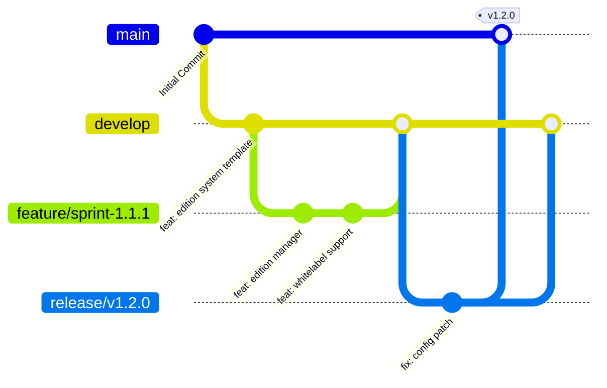

# GitHub Release & Tagging Strategy

Bu belge, tek kod tabanlı (single-codebase) Eğitim Kurumu SaaS platformumuzun GitHub üzerindeki versiyonlama, etiketleme (tagging), dal (branch) ve sürüm yayınlama (release) süreçlerini standartlaştırır.

---

## 1. Sürüm Modeli ve Semantic Versioning (SemVer)

Proje sürümleri **Semantic Versioning 2.0.0** standartlarına göre etiketlenir. Sürümler `vX.Y.Z` formatında tanımlanır:
- **`X` (MAJOR):** Geriye dönük uyumsuz (breaking) mimari değişiklikler veya temel sürüm altyapısının değişmesi durumunda.
- **`Y` (MINOR):** Geriye dönük uyumlu yeni özelliklerin eklenmesi (Örn: CRM, Yeni Raporlama Modülü).
- **`Z` (PATCH):** Geriye dönük uyumlu hata düzeltmeleri (bug fixes) ve performans iyileştirmeleri.

> [!IMPORTANT]
> Git etiketleri (Git Tags) **yalnızca** `v0.5.0`, `v1.0.0` gibi SemVer standartlarına uygun olmalıdır. `basic`, `professional` veya `ultimate` gibi paket isimleri kesinlikle Git etiketi olarak kullanılmayacaktır.

---

## 2. Branch (Dal) Yönetimi

Geliştirme süreçleri aşağıdaki branch hiyerarşisine uygun olarak yürütülür:



- **`main`**: Yalnızca kararlı (production-ready) ve canlıya alınmış sürümleri barındırır. Doğrudan commit atılamaz.
- **`develop`**: Günlük geliştirme süreçlerinin birleştiği ana daldır. Özellik dalları buraya merge edilir.
- **`feature/*`**: Yeni bir sprint veya özellik için açılan dallardır. `develop` dalından dallanır ve iş bittiğinde `PR` (Pull Request) ile `develop` dalına birleştirilir.
- **`release/*`**: Yeni bir SemVer sürümü yayınlanmadan önce yapılan son testler ve düzeltmeler için açılır. Testlerden sonra hem `main` hem de `develop` dalları ile birleştirilerek kapatılır.
- **`hotfix/*`**: Canlı ortamda (`main`) ortaya çıkan kritik hataları düzeltmek için doğrudan `main` dalından dallanır, düzeltildikten sonra hem `main` hem de `develop` dallarına merge edilip etiketlenir.

---

## 3. Edition Mapping (Paket Sürüm Eşleşmeleri)

Tek kod tabanı üzerinden Basic, Professional ve Ultimate paketleri tek bir sürüm (örn: `v1.2.0`) çatısı altında sunulur. Bir paketin etkinleştirilmesi kod dağıtımıyla değil, `config/features.php` veya `.env` üzerinden yönetilen **Feature Flags** ile yapılır:

| Git Tag (Sürüm) | Basic Edition | Professional Edition | Ultimate Edition |
| :--- | :--- | :--- | :--- |
| **`v1.0.0`** | `SAAS_EDITION=basic` | `SAAS_EDITION=professional` | `SAAS_EDITION=ultimate` |
| **`v1.1.0`** | `SAAS_EDITION=basic` | `SAAS_EDITION=professional` | `SAAS_EDITION=ultimate` |

Aynı kod tabanı, sunucu ortam değişkenine (`.env`) göre farklı paket özellikleri sunacak şekilde davranır.

---

## 4. Release Notes (Sürüm Notları) Şablonu

Her yeni GitHub Release oluşturulduğunda, aşağıdaki standart sürüm notu şablonu doldurulmalıdır:

```markdown
# Release v1.2.0 (Yyyy-Mm-Dd)

## 🚀 Yeni Özellikler
- [CRM] Ön kayıt takipleri için görsel satış hunisi eklendi.
- [Edition] EditionManager altyapısı kurularak Basic/Professional/Ultimate ayrımı tamamlandı.

## 🐛 Hata Düzeltmeleri
- [Blade] JSON-LD `@context` parse hataları giderildi.

## 📦 Paket Değişiklikleri (Edition Changes)
- **Basic:** Kurumsal ön kayıt formu iyileştirildi.
- **Professional:** Öğrenci kartı profil yönetimi eklendi.
- **Ultimate:** Ödev yükleme ve öğretmen onay mekanizması kuruldu.
```
