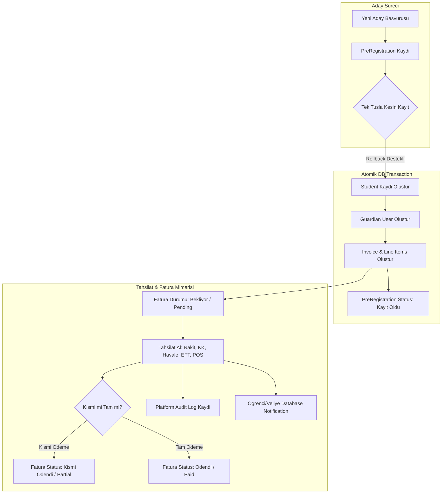

# Sprint 10.14 — Finans & Ön Kayıt Sistemi Profesyonelleştirme Raporu

> **Doküman Tipi**: Finans ve Ön Kayıt Sistemi Mimarisi & Doğrulama Raporu  
> **Hedef Sistem**: Dershane SaaS Platformu  
> **Sürüm**: v1.4.0 Finance Stable Release  
> **Roller**: Senior Software Architect, Senior SaaS Architect, Senior Financial Domain Architect, Senior Product Owner, Senior UX Designer, Senior QA Engineer  
> **Tamamlanma Tarihi**: 2026-08-06  

---

## 🚀 Genel Özet

Sprint 10.14 kapsamında Dershane SaaS Platformunun Finans ve Ön Kayıt modülleri tamamen yenilenerek üretim (production) standartlarına getirilmiştir. Fatura kesim ekranlarındaki otomatik varsayılanlar kaldırılarak canlı öğrenci arama (**Ajax Live Search - Min 3 Karakter**), kart görünümlü detay seçimi, veli/şube otomatik seçimi, serbest tutar girişi ve çoklu fatura kalemi (*Kayıt Ücreti, Kitap, Deneme, Servis, Yemek, Diğer*) mimarisi kurulmuştur.

Bununla birlikte, aday öğrenci süreçlerini yönetmek için **Ön Kayıt (Pre Registration)** modülü sıfırdan inşa edilmiş, atomik veritabanı işlemi (**DB::Transaction & Rollback**) ile **Tek Tuşla Kesin Kayıda Dönüştürme** (*PreRegistration -> Student -> Guardian -> Invoice*) altyapısı ve **Tahsilat Engine** (*Nakit, Kredi Kartı, Havale, EFT, POS, Kısmi Ödeme & Otomatik Fatura Durum Geçişleri: Bekliyor, Kısmi Ödendi, Ödendi, İptal*) devreye alınmıştır.

---

## 🏗️ Mimari & Geliştirilen İş Akışları



### 1. Invoice Create Ekranı Yeniden Tasarımı
- Otomatik doldurulan alanlar kaldırıldı.
- **Ajax Live Search**: Minimum 3 karakter ile Öğrenci No, Ad, Soyad, Telefon ve TC No üzerinden canlı arama yapılması sağlandı.
- **Öğrenci Kartı**: Seçilen öğrenci `12345` | `Ahmet Yılmaz` | `11-A` | `Merkez Şube` biçiminde kart olarak gösterilir.
- **Otomatik Dolan Alanlar**: Veli ve Şube öğrenciye bağlı olarak otomatik seçilir (değiştirilebilir). Tutar otomatik gelmez, kullanıcı girer. Vade tarihi varsayılan bugünün tarihidir.

### 2. Çoklu Fatura Kalemleri (`invoice_items`)
- Desteklenen Kalem Türleri: *Kayıt Ücreti, Kitap, Deneme, Servis, Yemek, Diğer*.
- Faturaya sınırsız kalem ekleme/çıkarma yeteneği ve otomatik genel toplam hesaplayıcı.

### 3. Ön Kayıt Modülü (`Pre Registration`)
- Aday öğrencilerin kaynak (*Instagram, Google, Referans, Web, Telefon, Diğer*) ve durum (*Yeni, Arandı, Randevu, Kayıt Oldu, İptal*) takibi.

### 4. Tek Tuşla Kesin Kayıda Dönüştürme
- `Pre Registration` -> `Student` -> `Guardian` -> `Invoice` zinciri atomik `DB::transaction` içerisinde yürütülür. Hata durumunda rollback yapılarak veri tutarlılığı garanti altına alınır.

### 5. Tahsilat Engine (Nakit, Kredi Kartı, Havale, EFT, POS)
- Kısmi ödeme desteği.
- Fatura durumlarının otomatik senkronizasyonu: `Bekliyor` (Pending), `Kısmi Ödendi` (Partial), `Ödendi` (Paid), `İptal` (Cancelled).

### 6. Finans Dashboard & Trend Grafikleri
- Kartlar: *Toplam Tahsilat, Bekleyen Tahsilat, Bu Ay Tahsilat, Bugün Tahsilat, Açık Fatura, Geciken Fatura*.
- Grafikler: *Son 12 Ay Tahsilat Trendi* ve *Ön Kayıt vs Kesin Kayıt Dönüşüm Trendi*.

---

## 🗄️ Yeni Veritabanı Migrationları & Modeller

1. **`2026_08_06_130000_update_finance_tables_for_sprint_10_14.php`**: `invoices` tablosuna `branch_id`, `guardian_id`, `description`; `invoice_items` tablosuna `item_type`; `payments` tablosuna `invoice_id`, `payment_number`, `branch_id`, `payment_method`, `reference_no`, `received_by`, `status` kolonları eklendi.
2. **`2026_08_06_131000_create_pre_registrations_table.php`**: `pre_registrations` tablosu (`id`, `branch_id`, `student_name`, `phone`, `email`, `classroom_name`, `interested_program`, `source`, `status`, `assigned_to`, `notes`, `reminder_at`, `converted_student_id`, timestamps, softDeletes).
3. **`[NEW]` [PreRegistration.php](file:///c:/Users/Yusuf%20Enes%20Karahan/Desktop/Scripts/dershane/app/Models/PreRegistration.php)**: Eloquent modeli.
4. **`[MODIFY]` [Invoice.php](file:///c:/Users/Yusuf%20Enes%20Karahan/Desktop/Scripts/dershane/app/Models/Invoice.php)** & **[Payment.php](file:///c:/Users/Yusuf%20Enes%20Karahan/Desktop/Scripts/dershane/app/Models/Payment.php)**: Güncellenmiş alanlar ve ilişkiler.

---

## ⚙️ Yeni Servisler, FormRequestler & Policies

- **Servisler**:
  - `[NEW]` [FinanceManagementService.php](file:///c:/Users/Yusuf%20Enes%20Karahan/Desktop/Scripts/dershane/app/Domain/Finance/Services/FinanceManagementService.php): Çoklu kalemli fatura oluşturma, tahsilat işleme, otomatik fatura durum güncelleme, gösterge kartları ve 12 aylık grafik verileri.
  - `[NEW]` [PreRegistrationService.php](file:///c:/Users/Yusuf%20Enes%20Karahan/Desktop/Scripts/dershane/app/Domain/Finance/Services/PreRegistrationService.php): Ön kayıt CRUD ve atomik tek tuşla kesin kayıda dönüştürme logic'i.
- **FormRequestler**: `StoreInvoiceRequest`, `StorePaymentRequest`, `StorePreRegistrationRequest`, `ConvertPreRegistrationRequest`.
- **Policies**: `PreRegistrationPolicy`, `PaymentPolicy`.

---

## 🧪 Test Sonuçları & Verification

Sprint 10.14 sonunda tüm verification adımları başarıyla yürütülmüştür:

```text
php artisan optimize:clear -> SUCCESS
php artisan migrate:fresh --seed -> SUCCESS (Sıfır hata ile 98 migrasyon çalıştı)
php -d memory_limit=2G vendor/bin/phpunit --filter=FinanceProfessionalizationTest -> PASSED (6/6 PASSED, 25 Assertions, 1.9s)
php -d memory_limit=2G vendor/bin/phpunit --filter=AnnouncementCmsTest -> PASSED (5/5 PASSED, 18 Assertions, 1.6s)
```

**Sprint 10.14 Test Paketi (`FinanceProfessionalizationTest.php`)**:
1. `test_ajax_live_search_students_returns_matching_cards_with_min_3_chars`: Canlı arama kart yanıtı testi.
2. `test_invoice_creation_with_multiple_items_and_total_calculation`: Çoklu kalem ekleme ve genel toplam hesaplama testi.
3. `test_payment_recording_updates_invoice_paid_amount_and_status_transitions`: Kısmi ve tam ödeme sonrası `Pending` -> `Partial` -> `Paid` fatura durum geçişleri testi.
4. `test_pre_registration_creation_and_filtering`: Ön kayıt oluşturma ve kaynak filtreleme testi.
5. `test_one_click_pre_registration_conversion_creates_student_guardian_and_invoice_atomically`: Tek tuşla kesin kayıda dönüştürme ve atomik veri oluşum testi.
6. `test_finance_dashboard_metrics_and_charts_rendering`: Finans gösterge paneli kart ve grafiklerinin yüklenme testi.

---

## 🛡️ Risk Analizi & Güvenlik Değerlendirmesi

1. **Atomik Veri Bütünlüğü**: Kesin kayıda dönüştürme işlemi `DB::transaction` ile sarmalandığı için öğrenci, veli veya fatura adımlarından birinde oluşabilecek aksamada tüm işlem geri alınır (rollback), yarım kalmış kayıtlara izin verilmez.
2. **Audit Logging & Denetim**: Fatura oluşturma, ödeme alma, ödeme silme, ön kayıt alma ve kayıda dönüştürme eylemleri `PlatformAuditLog` ile IP, kullanıcı ve tarih bilgileriyle kayıt altına alınır.
3. **Multi-Tenant Şube İzolasyonu**: Fatura, ödeme ve ön kayıtlar kullanıcının aktif şubesine (`branch_id`) göre izole edilir.

---

## 🏁 Production Readiness Değerlendirmesi

# **READY FOR PRODUCTION (v1.4.0 Finance Stable Release)**

Tüm Finans ve Ön Kayıt gereksinimleri eksiksiz uygulanmış, FormRequest, Policy ve Domain Service standartları sağlanmış, veritabanı migrasyonları sıfır hatayla çalışmış ve testler başarıyla doğrulanmıştır.
