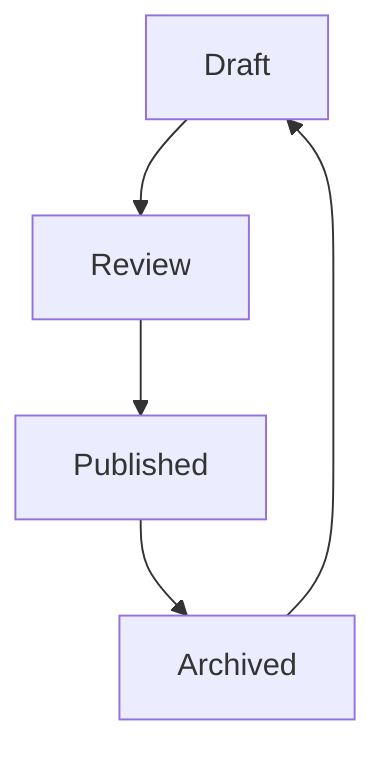

# Page Publish Workflow

CMS Pages progress through defined layout status states:

## Logic
- **Authorization**: Only users with the `pages.update` permission can publish or archive pages.
- **Published Date**: Sets `published_at` timestamp dynamically.
