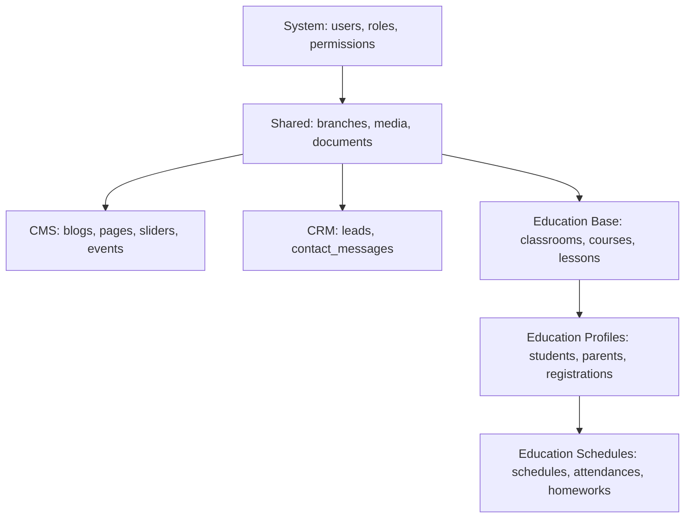

# Migration Roadmap & Strategy (Göç Planı ve Strateji)

Bu doküman, gelecek sprintlerde veritabanı tablolarının hangi sıra ile oluşturulacağını ve göç (migration) stratejisini planlar. Bağımlı tabloların hatasız kurulabilmesi için sıra takibi zorunludur.

## 1. Göç Sıralaması (Sequence)

Veritabanı oluşturulurken foreign key bağımlılıkları nedeniyle aşağıdaki sıra takip edilecektir:

---

## 2. Sprint Bazlı Göç Yol Haritası

### Sprint 1: Çekirdek Sistem Tabloları (System & Shared Base)
- `branches` (Şubeler)
- `users` (Ortak kullanıcı tablosu - Laravel default tablosu SaaS'a uyarlanacak)
- `roles` (Roller)
- `permissions` (Yetkiler)
- `user_has_roles` & `role_has_permissions` (Pivot yetki tabloları)
- `media` & `documents` (Polimorfik dosya tabloları)
- `settings` (Sistem ayarları tablosu)

### Sprint 2: CRM ve CMS Tabloları (Version 1 & 2 Base)
- `pages` (Web sayfaları)
- `sliders` (Kayan görseller)
- `blog_categories` & `blogs` (Haber ve duyurular)
- `events` & `announcements` (Etkinlik ve duyurular)
- `leads` (Aday öğrenci talepleri)
- `contact_messages` (Ziyaretçi mesajları)

### Sprint 3: Temel Eğitim Yapıları (Version 2 Base)
- `classrooms` (Derslikler)
- `lessons` (Ders tanımları)
- `courses` (Kurs paketleri)
- `course_lesson` (Pivot tablo)

### Sprint 4: Öğrenci, Veli ve Kayıt Profilleri (Version 2 Base)
- `students` (Öğrenci profilleri)
- `parents` (Veli profilleri)
- `student_parent` (Pivot aile tablosu)
- `registrations` (Kurum öğrenci kayıtları)

### Sprint 5: Eğitim Takvim ve Ödev Yönetimi (Version 3 Base)
- `lesson_schedules` (Haftalık ders programı planı)
- `attendances` (Günlük yoklama kayıtları)
- `homeworks` (Ödev tanımları)
- `homework_submissions` (Öğrenci ödev teslimleri)

### Sprint 6: Sistem Günlükleri ve Yardımcı Tablolar
- `activity_logs` (Audit günlükleri)
- `notifications` (Bildirim tablosu)

---

## 3. Göç Kuralları ve Stratejisi
1. **İlişki Kısıtları:** Tüm foreign key tanımlamaları şema seviyesinde `foreignId()->constrained()` ile yapılmalıdır.
2. **SQLite Desteği:** Yerel geliştirme ortamında SQLite kullanılacağı için, SQLite'ın desteklemediği karmaşık veri tiplerinden kaçınılacaktır (örn: doğrudan veritabanı seviyesinde `enum` veya bazı kısıt tipleri).
3. **Rollback Güvencesi:** Her migration dosyasındaki `down()` metodu, `up()` metodunda yapılan tüm işlemleri eksiksiz ve veritabanı bütünlüğünü bozmadan geri alacak (drop, dropForeign vb.) şekilde yazılacaktır.
